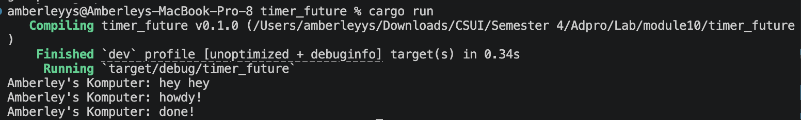
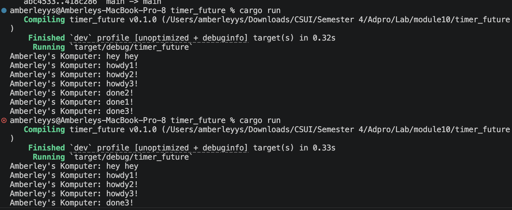
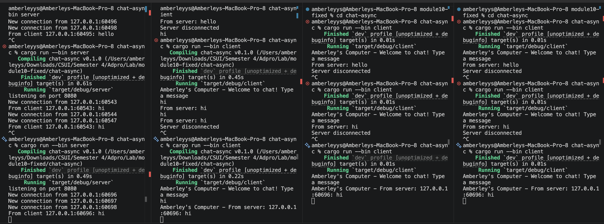

## Experiment 1.2: Understanding how it works

I added a new print statement after `spawner.spawn(...)`:

```rust
println!("Amberley's Komputer: hey hey");
```
the output was:

 

The reason hey hey appears first is because spawner.spawn(...) only puts the async task into the executor queue. It does not immediately execute the async block.

The async block starts running only when executor.run() is called. After that, the executor polls the task. The task prints howdy!, then waits for TimerFuture for 2 seconds. When the timer finishes, it wakes the task, and the executor polls it again, so it prints done!

## Experiment 1.3: Multiple Spawn

I added three async tasks using `spawner.spawn(...)`.

Each task prints `howdy`, waits for 2 seconds using `TimerFuture`, then prints `done`.

The output shows that all `howdy` messages appear first, then after around 2 seconds, all `done` messages appear.

This happens because each spawned async block becomes a separate task. The executor polls each task once. Each task prints its `howdy` message, then reaches `.await` and becomes pending. The timers run in separate threads. When the timers finish, they wake the tasks and put them back into the executor queue. Then the executor polls them again and they print the `done` messages.

This shows that the tasks are running concurrently, not one by one sequentially.

### Removing `drop(spawner)`

When I removed `drop(spawner)`, the program printed all the messages, but it did not terminate.

This happens because the executor waits on `ready_queue.recv()`. The `recv()` function keeps waiting as long as there is still a sender alive. The `spawner` owns the sender side of the channel.

When `drop(spawner)` is used, the sender is closed. This tells the executor that there will be no more incoming tasks. After all tasks are complete, the executor can stop.

When `drop(spawner)` is removed, the sender is still alive, so the executor keeps waiting for possible future tasks forever.

 

## Experiment 2.1: Original code, and how it run

In this experiment, I created a broadcast chat application using Tokio and WebSocket.

The application has two binaries:
- `server.rs` as the chat server
- `client.rs` as the chat client

The server is run using:

```bash
cargo run --bin server
```

The client is run using:

```bash
cargo run --bin client
```

I ran one server and three clients. When one client sends a message, the server receives the message and broadcasts it to all connected clients.

This works because the server uses a broadcast channel. Every connected client subscribes to the same broadcast sender. When a message is received from one client, the server sends it into the broadcast channel, then each client receives the message from the channel and sends it through its WebSocket connection.

## Experiment 2.2: Modifying port

I changed the WebSocket port from `2000` to `8080`.

The port must be changed in both the server and the client.

In `server.rs`, the server listens on this address:

```rust
TcpListener::bind("127.0.0.1:8080")
```

In `client.rs`, the client connects to this WebSocket URI:
```rust
Uri::from_static("ws://127.0.0.1:8080")
```

Both sides must use the same port. If the server uses port 8080 but the client still connects to port 2000, the client will fail to connect.

The protocol used is WebSocket, shown by the ws:// prefix in the client URI.

## Experiment 2.3: Small changes, add IP and Port

In this experiment, I modified the server so that each broadcasted message includes the sender's IP address and port.

I changed this line:

```rust
bcast_tx.send(text.to_string())?;
```

into:
```rust
bcast_tx.send(format!("{addr}: {text}"))?;
```

The variable addr comes from the TCP connection address. It contains the client IP address and port.
After this change, when a client sends a message, the other clients can see where the message came from. For example:

 

The port number can be different for each client because each connection uses a different temporary client port.